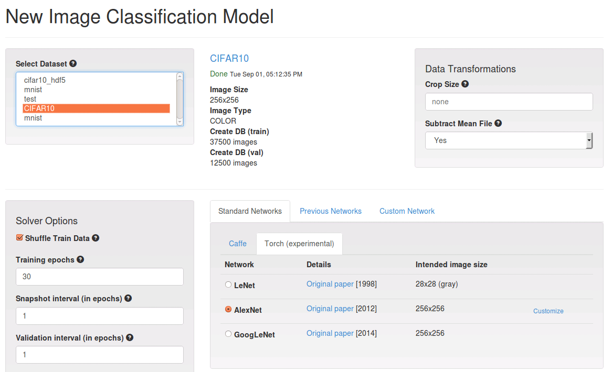

# Torch7 Installation and Usage

Follow these instructions to install Torch7 on Mac OS X and Ubuntu 12+:

http://torch.ch/docs/getting-started.html

## Luarocks dependencies

To use Torch7 in DIGITS, you need to install a few extra dependencies.

    % luarocks install image
    % luarocks install "https://raw.github.com/deepmind/torch-hdf5/master/hdf5-0-0.rockspec"

## Optional: LMDB

Follow these instructions if you wish to use Torch7 to train networks using LMDB-encoded datasets in DIGITS. You may skip this section if you wish to only use HDF5-encoded datasets:
[LMDB installation instructions](InstallTorchLMDB.md)

## Enabling support for Torch7 in DIGITS

DIGITS should automatically enable support for Torch7 if the `th` executable is in your path. If not, you may explicitely point DIGITS to the appropriate location:

```
(venv)gheinrich@android-devel-wks-7:/fast-scratch/gheinrich/ws/digits$ ./digits-devserver -c
...
==================================== Torch =====================================
Where is torch installed?

	Suggested values:
	(*)  [Previous]       <PATHS>
	(P)  [PATH/TORCHPATH] <PATHS>
	(N)  [none]           <NONE>
>> /home/user/torch/install/bin/th
```

## Selecting Torch7 when creating a model in DIGITS

Select one of the "torch" tabs on the model creation page:



## Defining a Torch7 model in DIGITS

To define a Torch7 model in DIGITS you need to write a Lua function that takes a table of external network parameters as argument and returns a table of internal network parameters. For example, the following code defines a flavour of LeNet:

```
require 'nn'

-- -- This is a LeNet model. For more information: http://yann.lecun.com/exdb/lenet/

local lenet = nn.Sequential()
lenet:add(nn.MulConstant(0.00390625))
lenet:add(nn.SpatialConvolution(1,20,5,5,1,1,0)) -- 1*28*28 -> 20*24*24
lenet:add(nn.SpatialMaxPooling(2, 2, 2, 2)) -- 20*24*24 -> 20*12*12
lenet:add(nn.SpatialConvolution(20,50,5,5,1,1,0)) -- 20*12*12 -> 50*8*8
lenet:add(nn.SpatialMaxPooling(2,2,2,2)) --  50*8*8 -> 50*4*4
lenet:add(nn.View(-1):setNumInputDims(3))  -- 50*4*4 -> 800
lenet:add(nn.Linear(800,500))  -- 800 -> 500
lenet:add(nn.ReLU())
lenet:add(nn.Linear(500, 10))  -- 500 -> 10
lenet:add(nn.LogSoftMax())

-- return function that returns network definition
return function(params)
    assert(params.ngpus<=1, 'Model supports only CPU or single-GPU')
    return {
        model = lenet,
        loss = nn.ClassNLLCriterion()
    }
end
```

#### External parameters

External parameters are provided by DIGITS:

Parameter name  | Type     | Description
--------------- | -------- | --------
ngpus           | number   | Tells how many GPUs are available (0 means CPU)

#### Internal parameters

Those parameters are returned by the user-defined function:

Parameter name  | Type         | Mandatory | Description
--------------- | ------------ | --------- | -------------
model           | nn.module    | Yes       | A nn.module container that defines the model to use
loss            | nn.criterion | No        | A nn.criterion to use during training. Defaults to nn.ClassNLLCriterion.
crop            | number       | No        | If specified, inputs images will be cropped randomly to a square of the specified size

#### Tensors

Networks are fed with Torch Tensor objects in the NxCxHxW format (index in batch x channels x height x width). If a GPU is available, Tensors are provided as Cuda tensors and the model and criterion are moved to GPUs through a call to their cuda() method. In the absence of GPUs, Tensors are provided as Float tensors.

## Example Classification with Torch7 model trained in DIGITS

DIGITS Lua wrappers may also be used from command line. For example, to classify an image using the snapshot at epoch `10` of a model job `20150921-141321-86c1` using a dataset `20150916-001059-e0cd`:

```
th /fast-scratch/gheinrich/ws/digits/tools/torch/test.lua --image=/path/to/image.png --network=model --networkDirectory=/path/to/jobs/20150921-141321-86c1 --load=/path/to/20150921-141321-86c1 --snapshotPrefix=snapshot --mean=/path/to/jobs/20150916-001059-e0cd/mean.jpg --labels=/path/to/jobs/20150916-001059-e0cd/labels.txt --epoch=10 --useMeanPixel=yes --crop=no --subtractMean=yes
2015-09-22 15:21:55 [INFO ] Loading network definition from /path/to/jobs/20150921-141321-86c1/model
2015-09-22 15:21:55 [INFO ] Loading /path/to/jobs/20150921-141321-86c1/snapshot_10_Weights.t7 file
2015-09-22 15:21:55 [INFO ] For image 1, predicted class 1: 10 (9) 0.99923830445863
2015-09-22 15:21:55 [INFO ] For image 1, predicted class 2: 9 (8) 0.00074051392287852
2015-09-22 15:21:55 [INFO ] For image 1, predicted class 3: 8 (7) 1.6892548943146e-05
2015-09-22 15:21:55 [INFO ] For image 1, predicted class 4: 4 (3) 2.9689886060496e-06
2015-09-22 15:21:55 [INFO ] For image 1, predicted class 5: 5 (4) 9.7695222396362e-07
```

