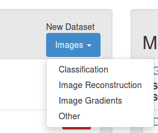
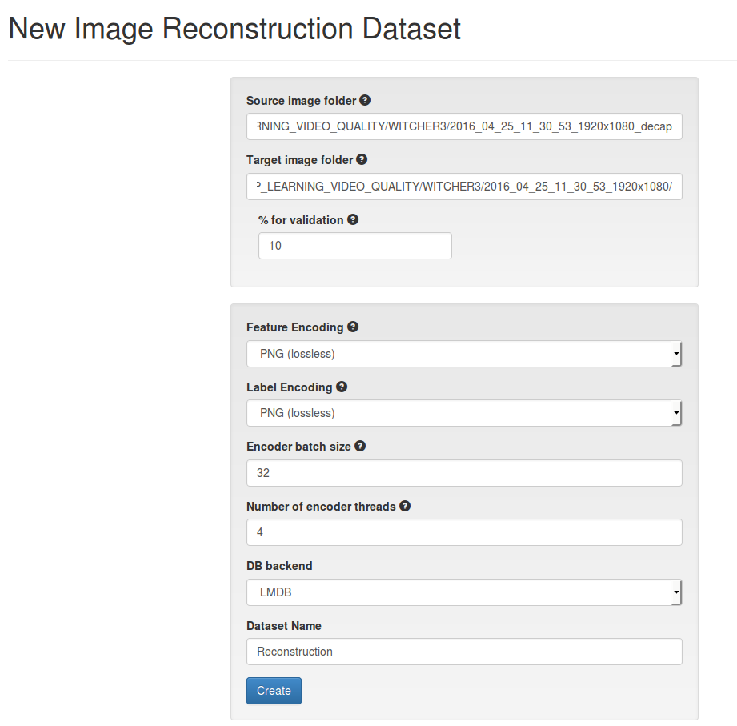
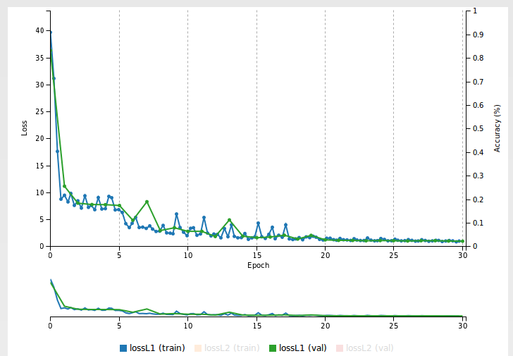
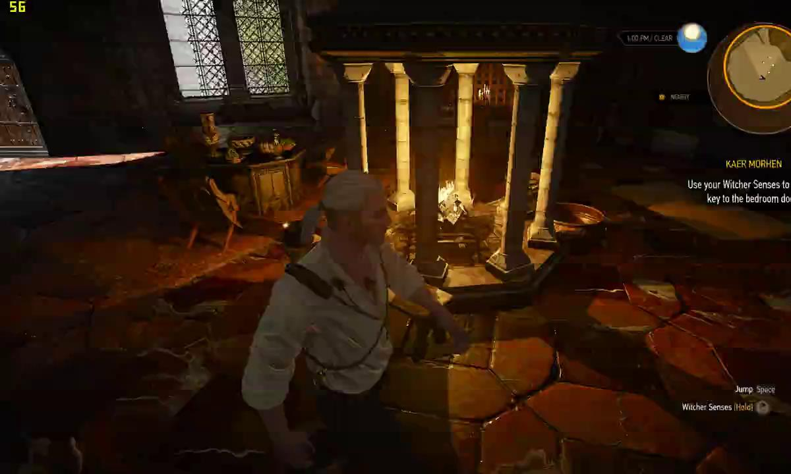
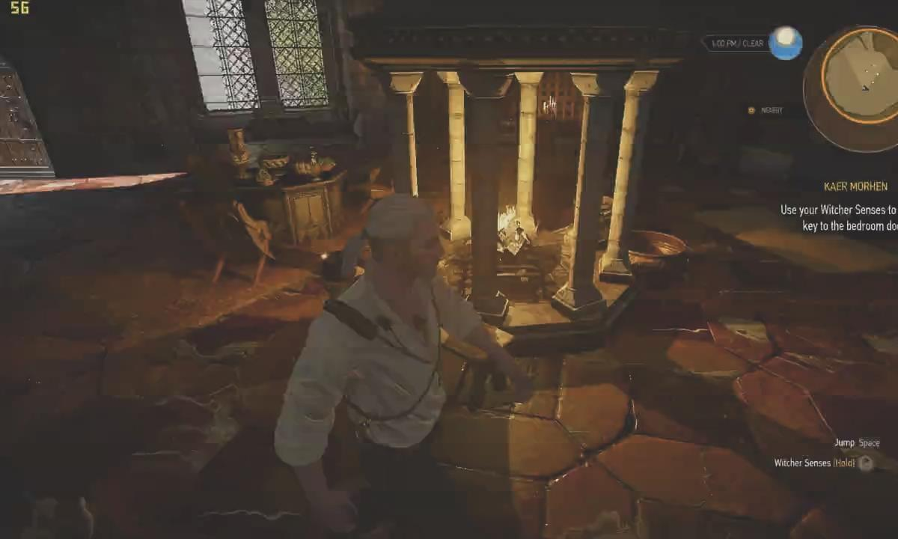

# Training an image reconstruction network in DIGITS

Table of Contents
=================
* [Introduction](#introduction)
* [Dataset creation](#dataset-creation)
* [Model creation](#model-creation)
* [Verification](#verification)

## Introduction

This example shows how to use DIGITS to create an image reconstruction dataset and train a Fully Convolutional Neural network.

## Version of DIGITS

Check out the image reconstruction branch:
```sh
$ git clone https://github.com/gheinrich/DIGITS.git
$ cd DIGITS
$ git checkout origin/dev/image-reconstruction
$ ./digits-devserver
```

DIGITS will start listening to port 5000.

## Dataset Creation

The dataset is structured as follows:
- the input is the image to reconstruct
- the label is the original image

We will assume original images are located in a folder and stored as `.bmp.gz` images and encoded images are stored in a `.h264` file (using equal resolution as the original images).

First, unzip all `.bmp.gz` files:
```sh
$ gunzip <PATH>/*.gz
```

If you haven't done so already, install `ffmpeg`:
```sh
$ sudo add-apt-repository ppa:mc3man/trusty-media
$ sudo apt-get update
$ sudo apt-get install ffmpeg
```

Un-encode the encoded stream:
```sh
ffmpeg <PATH>-xxx.h264 <PATH>_decap/decap_%06d.bmp
```

Now in DIGITS, go to the main page and in the dataset section select: `Image > Image Reconstruction`:



In the dataset creation page, set the paths to the source (`<PATH>_decap`) and target (`<PATH>`) folders. Set the label encoding to `PNG`.
Give your dataset a name e.g. `Reconstruction`. Leave other fields to their default value.
Then click `Create`:



## Model creation

In this example we are using a Super Resolution network inspired from:
> Dong, C., Loy, C., He, K., Tang, X.: Learning a deep convolutional network for image super-resolution. In: European Conference on Computer Vision. (2014) 184–199

We will be using the `L1` objective function, as suggested by:
> Hang Zhao, Orazio Gallo, Iuri Frosio, and Jan Kautz: Loss Functions for Neural Networks for Image Processing

On DIGITS home page, in the model section select: `Image > Other`.

On the next page, select the dataset you just created.
- In "Python Layers": point to the path of `loss.py` from `<DIGITS>/examples/image-reconstruction/loss.py`.
- In "Solver Options": tick the box "Show advanced learning rate options" and set the base learning rate to `0.001` then select the "Exponential Decay" policy and set Gamma to `0.098`.
- Click "Customer network" and copy paste this [network definition](sr-model.prototxt).
- Next, give your model a name and click `Create`.

Note that you can only use 1 GPU for training as Python layers are not compatible with multi-GPU training.

After about an hour, the L1 loss curve should like like:


## Validation

To test the network, on the model page:
- select the model snapshot that exhibits the lowest validation loss
- in "Test a single image", point to an image to reconstruct
- tick the box "Show visualizations and statistics"
- click "Test one"

The next page will show the activations of each layer, from which the input and output of the network can be extracted.

Input:


Output:


Ground truth:


